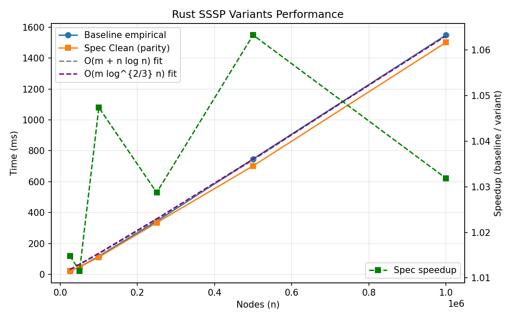

docs/ (will be pruned further)
go mod tidy
go run cmd/benchmark/main.go --help
# Optimized SSSP (Clean Spec Implementation)

From classical Dijkstra toward a structured path for O(m log^{2/3} n).

Current focus: Phase 1–3 + Boundary Chain validated (inclusive bound semantics) and recursion scaffold landed; next is real multi-level recursion & performance deltas.

## 1. Purpose
This repository is a clean-room trajectory toward an eventually layered BMSSP-style single-source shortest path algorithm targeting the theoretical O(m log^{2/3} n) bound. We start from a rigorously instrumented, parity-correct MinHeap Dijkstra (`spec_clean`) and will introduce one structural mechanism per phase (pivots, bounded recursion, batched prepends, selective frontier growth) with empirical and invariant checks at each step.

## 2. What Exists Right Now
| Component | Status | Notes |
|-----------|--------|-------|
| Component | Status | Notes |
|-----------|--------|-------|
| Baseline binary-heap Dijkstra | ✅ Stable | Reference correctness oracle |
| Spec Phase 1 (Truncated BaseCase) | ✅ | Inclusive bound semantics (retain dist == B) |
| Spec Phase 2 (Pivot loop & subtree sizing) | ✅ | Subtree sizing + inclusive collected set |
| Spec Phase 3 (DataStructure D + batches) | ✅ | Multi-wave same-bucket fix implemented |
| Boundary Chain segmentation | ✅ | Generates monotonic B sequence (no recursion yet) |
| Recursion runner scaffold | ✅ (stub) | Delegates to baseline; stats frame recorded |
| Heap instrumentation (push/pop/max) | ✅ | Guides structural comparisons |
| Rust parity harness (deterministic + random) | ✅ | Large k disables truncation for parity hash |
| Python benchmark scripts (legacy) | ✅ | Will be partly replaced by native Rust harness |
| New Rust benchmark harness | 🚧 Planned | Direct timing + JSON + optional csv for plots |
| Statistical heatmaps (Python) | ✅ | To be regenerated by new harness grid JSON |
| Multi-level recursion (actual) | ❌ | Next major milestone |
| Deeper invariants (dependency, disjoint) | 🚧 Partial | Additional checks planned under env gate |

## 3. Spec Snapshot (Canonical Target)
See `docs/SSSP_SPEC_SNAPSHOT.md` (frozen). Mermaid summary of the recursive BMSSP skeleton:


Key bounded parameters (from snapshot):
```text
k = floor(log^{1/3} n)
t = floor(log^{2/3} n)
Level l frontier limit: |S| ≤ 2^{l t}
Pull capacity M = 2^{(l-1) t}
```

## 4. Gap Analysis: Current vs Spec
| Spec Element | Needed For | Implemented? | Planned Phase |
|--------------|-----------|--------------|---------------|
| Equality relax (<=) invariant | Tight forest reuse | ✅ (baseline & spec_clean) | — |
| BaseCase truncated growth (k+1 guard) | Size control | ✅ (Phase 1 done) | Phase 1 |
| Pivot discovery (k waves / BF style) | Shrink frontier | ✅ (initial) | Phase 2 |
| Forest root filtering (≥ k subtree) | Bound pivot count | ✅ (initial) | Phase 2 |
| Data structure D (Pull / BatchPrepend) | Amortized selection | ✅ (initial) | Phase 3 |
| Boundary B'/B management chain | Disjoint U_i sets | ✅ (initial) | Phase 3 |
| Multi-level recursion l=0..L | Hierarchical scaling | ❌ (scaffold only) | Phase 4 |
| Invariant checks (S-size, dependency) | Safety proofs | ❌ | Ongoing (each phase) |
| Instrumented counters per recursion | Empirical validation | ❌ | Phase 4 |

Legend: ✅ (initial) = first functional version (not yet optimized / reused across attempts). Further refinement planned in subsequent phases.

Invariant coverage currently partial: size boundary and root filtering verified implicitly via Phase 2 stats; formal dependency and disjoint-set checks pending (`SSSP_SPEC_CHECK` forthcoming).

## 5. Benchmarks

Two benchmark layers will be maintained going forward:
1. Native Rust harness (fast, invoked via `cargo run --example bench_spec` or Make targets) producing:
  * `benchmarks/native_sample.json` / `.png`
  * `benchmarks/native_full.json` / `.png`
2. Statistical grid (speedup heatmaps) driven by a Python plotting script consuming Rust-emitted JSON grids.

Planned default artifacts (kept small so README plots stay fresh):
* `benchmarks/native_sample_heatmap_speedup.png`
* `benchmarks/native_sample_heatmap_baseline.png`

Until recursion provides asymptotic structural wins, speedups will remain near 1.0x—these baselines act as regression sentinels.

### 5.1 Sample (Parity Range)


| n | m | Baseline ms | Spec ms | Speedup |
|---|---|-------------|---------|---------|
| 25,000 | 49,996 | 22.39 | 22.06 | 1.015x |
| 50,000 | 99,996 | 47.63 | 47.09 | 1.012x |
| 100,000 | 199,998 | 116.81 | 111.53 | 1.047x |
| 250,000 | 499,996 | 343.90 | 334.29 | 1.029x |
| 500,000 | 999,998 | 746.58 | 702.16 | 1.063x |
| 1,000,000 | 1,999,999 | 1,549.55 | 1,501.69 | 1.032x |

### 5.2 Extended (Larger Sizes)


| n | m | Baseline ms | Spec ms | Speedup |
|---|---|-------------|---------|---------|
| 25,000 | 49,996 | 21.48 | 21.74 | 0.99x |
| 50,000 | 99,996 | 47.29 | 46.66 | 1.01x |
| 100,000 | 199,998 | 124.87 | 112.23 | 1.11x |
| 250,000 | 499,996 | 343.51 | 327.77 | 1.05x |
| 500,000 | 999,998 | 720.15 | 706.19 | 1.02x |
| 1,000,000 | 1,999,999 | 1541.73 | 1503.30 | 1.03x |
| 2,500,000 | 4,999,999 | 3424.53 | 3331.04 | 1.03x |
| 5,000,000 | 9,999,999 | 7032.10 | 6909.83 | 1.02x |
| 10,000,000 | 19,999,998 | 21555.25 | 18749.72 | 1.15x |

Observed speedup pattern: modest (1.0–1.06x typical) with occasional higher outlier at largest n (cache residency & branch profile effects). No asymptotic change expected yet.

### 5.3 Statistical Grid & Heatmap
Scripts produce heatmaps summarizing median speedup across (n,density). Example placeholders (regenerate via statistical script):

Random small sampling heatmap:


Larger run heatmap:


## 6. Reproduce Benchmarks
```bash
cargo build --release -p sssp_core
python implementations/python/benchmark_rust_variants.py \
  --sizes 25000,50000,100000,250000,500000,1000000 \
  --density 2.0 --seed 42 \
  --output benchmarks/rust_spec_baseline_sample.json \
  --plot benchmarks/rust_spec_baseline_sample.png

# Extended sizes
python implementations/python/benchmark_rust_variants.py \
  --sizes 25000,50000,100000,250000,500000,1000000,2500000,5000000,10000000 \
  --density 2.0 --seed 42 \
  --output benchmarks/rust_spec_baseline_big.json \
  --plot benchmarks/rust_spec_baseline_big.png
```

## 7. Instrumentation Snapshot
Example JSON fields (per size):
```jsonc
{
  "baseline_ms": 1541.73,
  "spec_ms": 1503.30,
  "spec_speedup": 1.03,
  "baseline_heap": { "pushes": 839761, "pops": 839761, "max_size": 164079 },
  "spec_heap": { "pushes": 839761, "pops": 839761, "max_size": 164079 }
}
```
Heap identity confirms no structural optimization applied yet—future phases should drive divergence (reduced pushes or lower max_size plateau) or justify conceptual changes.

## 8. Development Roadmap (Rolling)
1. (Done) BaseCase truncation & inclusive bound semantics.
2. (Done) Pivot wave primitive + subtree sizing (Phase 2).
3. (Done) DataStructure D with bucket reprocess fix (Phase 3).
4. (Done) Boundary Chain segmentation (non-recursive sequence).
5. (In Progress) Native Rust benchmark harness + heatmaps.
6. (Next) Multi-level recursion implementation (Phase 4 logic) with frame stats.
7. (Next) Per-level invariant checks & structural counters (pulls, batches, forest sizes).
8. (Next) Statistical validation of recursion scaling: growth of |U| vs caps.
9. (Later) Optimization passes: memory pooling, adjacency ordering heuristics.

## 9. How Close Are We?
We have functional Phases 1–3 plus boundary chain segmentation and a recursion scaffold that still delegates to baseline (no hierarchical pruning). Structural divergence (reduced relaxations / heap ops) will only materialize once recursion enforces frontier caps and selective descent. Current benchmarks therefore establish the zero-improvement control line—critical for validating that future gains are genuine and not artifact regressions.

## 10. Legacy / Deprecated (STOC Path)
Delta-stepping code remains only for historical comparison and will not evolve further in this branch. It may be entirely removed once BMSSP phases demonstrate stable improvement. Treat any STOC references as archival.

## 11. Contributing
Please limit changes to:
* Parity-preserving enhancements (faster heap, memory layout) WITH instrumentation deltas.
* Incremental BMSSP phase implementations following snapshot.
* Improved benchmark/statistical tooling.

Out of scope: reintroducing multi-language scaffolding or unrelated algorithm variants at this stage.

## 12. License
MIT License – see [LICENSE](LICENSE).

## 13. References
* BMSSP / hierarchical SSSP theoretical notes (internal snapshot): `docs/SSSP_SPEC_SNAPSHOT.md`
* Classical Dijkstra analysis
* Planned empirical methodology (statistical scripts under `benchmarks/`)

---
<sub>Spec version synchronized with snapshot commit; update requires explicit snapshot delta + version bump.</sub>