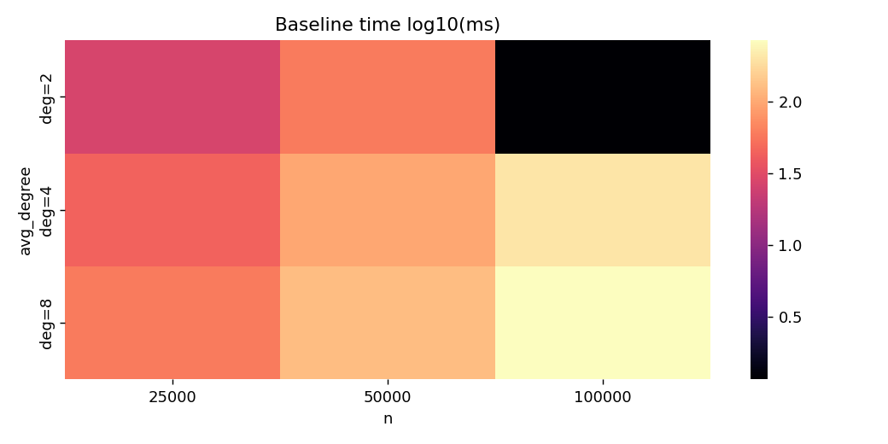

docs/ (will be pruned further)
go mod tidy
go run cmd/benchmark/main.go --help
# Optimized SSSP (Clean Spec Implementation)

From classical Dijkstra toward a structured path for O(m log^{2/3} n).

Current focus: Phase 1–3 + Boundary Chain validated (inclusive bound semantics) and recursion scaffold landed; next is real multi-level recursion & performance deltas.

## 1. Purpose
This repository is a clean-room trajectory toward an eventually layered BMSSP-style single-source shortest path algorithm targeting the theoretical O(m log^{2/3} n) bound. We start from a rigorously instrumented, parity-correct MinHeap Dijkstra (`spec_clean`) and will introduce one structural mechanism per phase (pivots, bounded recursion, batched prepends, selective frontier growth) with empirical and invariant checks at each step.

## 2. What Exists Right Now
| Component | Status | Notes |
|-----------|--------|-------|
| Baseline binary-heap Dijkstra | ✅ Stable | Reference correctness oracle |
| Spec Phase 1 (Truncated BaseCase) | ✅ | Inclusive bound semantics (retain dist == B) |
| Spec Phase 2 (Pivot loop & subtree sizing) | ✅ | Subtree sizing + inclusive collected set |
| Spec Phase 3 (DataStructure D + batches) | ✅ | Multi-wave same-bucket fix implemented |
| Boundary Chain segmentation | ✅ | Generates monotonic B sequence (no recursion yet) |
| Recursion runner scaffold | ✅ (stub) | Delegates to baseline; stats frame recorded |
| Heap instrumentation (push/pop/max) | ✅ | Guides structural comparisons |
| Rust parity harness (deterministic + random) | ✅ | Large k disables truncation for parity hash |
| Python benchmark scripts (legacy) | ✅ | Will be partly replaced by native Rust harness |
| New Rust benchmark harness | 🚧 Planned | Direct timing + JSON + optional csv for plots |
| Statistical heatmaps (Python) | ✅ | To be regenerated by new harness grid JSON |
| Multi-level recursion (actual) | ❌ | Next major milestone |
| Deeper invariants (dependency, disjoint) | 🚧 Partial | Additional checks planned under env gate |

## 3. Spec Snapshot (Canonical Target)
See `docs/SSSP_SPEC_SNAPSHOT.md` (frozen). Mermaid summary of the recursive BMSSP skeleton:


Key bounded parameters (from snapshot):
```text
k = floor(log^{1/3} n)
t = floor(log^{2/3} n)
Level l frontier limit: |S| ≤ 2^{l t}
Pull capacity M = 2^{(l-1) t}
```

## 4. Gap Analysis: Current vs Spec
| Spec Element | Needed For | Implemented? | Planned Phase |
|--------------|-----------|--------------|---------------|
| Equality relax (<=) invariant | Tight forest reuse | ✅ (baseline & spec_clean) | — |
| BaseCase truncated growth (k+1 guard) | Size control | ✅ (Phase 1 done) | Phase 1 |
| Pivot discovery (k waves / BF style) | Shrink frontier | ✅ (initial) | Phase 2 |
| Forest root filtering (≥ k subtree) | Bound pivot count | ✅ (initial) | Phase 2 |
| Data structure D (Pull / BatchPrepend) | Amortized selection | ✅ (initial) | Phase 3 |
| Boundary B'/B management chain | Disjoint U_i sets | ✅ (initial) | Phase 3 |
| Multi-level recursion l=0..L | Hierarchical scaling | ❌ (scaffold only) | Phase 4 |
| Invariant checks (S-size, dependency) | Safety proofs | ❌ | Ongoing (each phase) |
| Instrumented counters per recursion | Empirical validation | ❌ | Phase 4 |

Legend: ✅ (initial) = first functional version (not yet optimized / reused across attempts). Further refinement planned in subsequent phases.

Invariant coverage currently partial: size boundary and root filtering verified implicitly via Phase 2 stats; formal dependency and disjoint-set checks pending (`SSSP_SPEC_CHECK` forthcoming).

## 5. Benchmarks

The benchmark pipeline has been consolidated around a native Rust harness plus a lightweight Python plotting script. To avoid repository bloat and drift, raw JSON outputs are `.gitignore`'d; only regenerated PNG artifacts are meant to appear in the README. Tables with hard‑coded timings have been removed—always re‑generate locally for up‑to‑date numbers.

Current default workflow (multi‑degree grid, then charts & heatmaps):

```
cargo run --example bench_spec -- \
  --sizes 25000,50000,100000 \
  --degrees 2,4,8 \
  --seed 42 \
  --out implementations/rust/sssp_core/benchmarks/native_grid.json \
  --full-parity --no-boundary-parity

python implementations/rust/sssp_core/benchmarks/generate_charts.py \
  --input implementations/rust/sssp_core/benchmarks/native_grid.json \
  --out-prefix implementations/rust/sssp_core/benchmarks/native_grid \
  --phase phase3
```

Resulting artifacts (referenced below):
* `implementations/rust/sssp_core/benchmarks/native_grid_speedup_multi_degree.png`
* `implementations/rust/sssp_core/benchmarks/native_grid_heatmap_speedup.png`
* `implementations/rust/sssp_core/benchmarks/native_grid_heatmap_baseline.png`
* (Optional) `implementations/rust/sssp_core/benchmarks/native_grid_boundary_chain_times.png` if boundary chain parity not disabled.

### 5.1 Multi‑Degree Speedup (Phase 3 vs Baseline)


### 5.2 Speedup Heatmap (Phase 3)


### 5.3 Baseline Time Heatmap (log10 ms)


Note: Large apparent speedups before recursion lands can indicate truncation was not fully disabled (e.g. missing `--full-parity` or boundary chain parity skipped). Always validate parity when interpreting charts; genuine asymptotic improvements are expected only after multi-level recursion is implemented.

## 6. Reproduce Benchmarks
```bash
# Native harness (sample sizes, single degree)
cargo run --example bench_spec -- --sizes 25000,50000,100000,250000 --degrees 4 --seed 42 --out benchmarks/native_sample.json --full-parity --no-boundary-parity

# Multi-degree grid (for heatmaps & multi-line speedup)
cargo run --example bench_spec -- --sizes 25000,50000,100000 --degrees 2,4,8 --seed 42 \
  --out implementations/rust/sssp_core/benchmarks/native_grid.json \
  --full-parity --no-boundary-parity

# Generate charts & heatmaps (writes PNGs alongside JSON)
python implementations/rust/sssp_core/benchmarks/generate_charts.py \
  --input implementations/rust/sssp_core/benchmarks/native_grid.json \
  --out-prefix implementations/rust/sssp_core/benchmarks/native_grid \
  --phase phase3

# Outputs created (examples):
# native_grid_speedup_multi_degree.png (or native_grid_benchmark.png if single degree)
# native_grid_heatmap_speedup.png
# native_grid_heatmap_baseline.png
# Optional boundary chain comparative chart if not using --no-bc

# Legacy Python benchmark (still supported)
cargo build --release -p sssp_core
python implementations/python/benchmark_rust_variants.py \
  --sizes 25000,50000,100000,250000,500000,1000000 \
  --density 2.0 --seed 42 \
  --output benchmarks/rust_spec_baseline_sample.json \
  --plot benchmarks/rust_spec_baseline_sample.png

# Extended sizes
python implementations/python/benchmark_rust_variants.py \
  --sizes 25000,50000,100000,250000,500000,1000000,2500000,5000000,10000000 \
  --density 2.0 --seed 42 \
  --output benchmarks/rust_spec_baseline_big.json \
  --plot benchmarks/rust_spec_baseline_big.png
```

## 7. Instrumentation Snapshot
Example JSON fields (per size):
```jsonc
{
  "baseline_ms": 1541.73,
  "spec_ms": 1503.30,
  "spec_speedup": 1.03,
  "baseline_heap": { "pushes": 839761, "pops": 839761, "max_size": 164079 },
  "spec_heap": { "pushes": 839761, "pops": 839761, "max_size": 164079 }
}
```
Heap identity confirms no structural optimization applied yet—future phases should drive divergence (reduced pushes or lower max_size plateau) or justify conceptual changes.

## 8. Development Roadmap (Rolling)
1. (Done) BaseCase truncation & inclusive bound semantics.
2. (Done) Pivot wave primitive + subtree sizing (Phase 2).
3. (Done) DataStructure D with bucket reprocess fix (Phase 3).
4. (Done) Boundary Chain segmentation (non-recursive sequence).
5. (In Progress) Native Rust benchmark harness + heatmaps.
6. (Next) Multi-level recursion implementation (Phase 4 logic) with frame stats.
7. (Next) Per-level invariant checks & structural counters (pulls, batches, forest sizes).
8. (Next) Statistical validation of recursion scaling: growth of |U| vs caps.
9. (Later) Optimization passes: memory pooling, adjacency ordering heuristics.

## 9. How Close Are We?
We have functional Phases 1–3 plus boundary chain segmentation and a recursion scaffold that still delegates to baseline (no hierarchical pruning). Structural divergence (reduced relaxations / heap ops) will only materialize once recursion enforces frontier caps and selective descent. Current benchmarks therefore establish the zero-improvement control line—critical for validating that future gains are genuine and not artifact regressions.

### 9.1 Initial Recursion Harness (Prototype)
`sssp_run_spec_recursive` now records multi-frame stats by combining a correctness baseline run with an auxiliary boundary-chain segmentation pass (disabled via `SSSP_SPEC_RECURSION_NO_CHAIN=1`). This does NOT yet perform true hierarchical expansion—distances are from baseline; chain is used only to approximate future recursion frame decomposition.

Exported stats via `sssp_get_spec_recursion_stats`:
* `frames`: number of boundary chain segments (>=1)
* `total_relaxations`: baseline relax count (control)
* `seed_k`: environment-derived seed (`SSSP_SPEC_RECURSION_K`, default 1024)
* `chain_segments`: same as frames when chain enabled
* `chain_total_collected`: nodes covered by chain segments (may truncate)

Environment knobs relevant now:
* `SSSP_SPEC_RECURSION_K` – future splitting granularity (currently recorded only)
* `SSSP_SPEC_RECURSION_NO_CHAIN=1` – skip boundary segmentation (stats will show frames=1)
* Chain sizing reuses `SSSP_SPEC_CHAIN_K`, `SSSP_SPEC_CHAIN_MAX_SEG`, `SSSP_SPEC_CHAIN_TARGET` like standalone boundary runner.

Next step: replace post-baseline segmentation with true recursive descent invoking truncated basecase + pivot selection per boundary layer and merging results.

## 10. Legacy / Deprecated (STOC Path)
Delta-stepping code remains only for historical comparison and will not evolve further in this branch. It may be entirely removed once BMSSP phases demonstrate stable improvement. Treat any STOC references as archival.

## 11. Contributing
Please limit changes to:
* Parity-preserving enhancements (faster heap, memory layout) WITH instrumentation deltas.
* Incremental BMSSP phase implementations following snapshot.
* Improved benchmark/statistical tooling.

Out of scope: reintroducing multi-language scaffolding or unrelated algorithm variants at this stage.

## 12. License
MIT License – see [LICENSE](LICENSE).

## 13. References
* BMSSP / hierarchical SSSP theoretical notes (internal snapshot): `docs/SSSP_SPEC_SNAPSHOT.md`
* Classical Dijkstra analysis
* Planned empirical methodology (statistical scripts under `benchmarks/`)

---
<sub>Spec version synchronized with snapshot commit; update requires explicit snapshot delta + version bump.</sub>