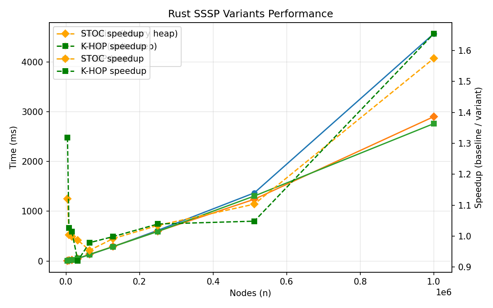

# Minimal Rust SSSP: Baseline Dijkstra vs Delta-Stepping ("STOC")

Repository intentionally reduced to a lean core for empirical study of two single-source shortest path variants:

* Baseline: Binary-heap Dijkstra (reference)
* STOC-style: Single-thread delta-stepping (light/heavy edge buckets) + optional autotuning of delta

All former native Go / C# / higher-layer algorithm variants have been removed to minimize noise. Python bindings remain only as a thin driver for benchmarking and scaling analysis.

## Algorithm Complexity

| Algorithm | Time Complexity | Space Complexity | Notes |
|-----------|----------------|------------------|-------|
| **Optimized SSSP** | **O(m log^(2/3) n)** | O(n + m) | Our implementation |
| Dijkstra | O((n + m) log n) | O(n + m) | Classical reference |
| Bellman-Ford | O(nm) | O(n + m) | Handles negative weights |
| SPFA | O(nm) worst-case | O(n + m) | Average case better |

## Current Layout (Trimmed)
```
implementations/
  rust/sssp_core/      # Core algorithms (C ABI)
  python/              # ctypes wrapper + benchmarks
benchmarks/
  benchmark_rust_variants.py  # Baseline vs STOC timing
  scaling_analysis.py         # Empirical scaling vs m·log n and m·log^{2/3} n
docs/ (will be pruned further)
```

## Quick Start

### Prerequisites

* Rust (stable) – build core library
* Python 3.10+ – run benchmarks (ctypes wrapper)

### Quick Start
```bash
git clone <repo>
cd optimized-sssp
cargo build --release -p sssp_core
python -m pip install -r requirements.txt  # if present / matplotlib optional
python implementations/python/benchmark_rust_variants.py --sizes 2000,4000,8000 --density 2.0
python benchmarks/scaling_analysis.py --sizes 2000,4000,8000,16000,32000 --density 2.0 --repeat 3
```

### Go Implementation

```bash
cd implementations/go
go mod tidy
go run cmd/benchmark/main.go --help
```

## Delta-Stepping Summary
Delta-stepping groups edges by weight threshold (delta). Within a bucket index b = floor(dist/δ):
1. Repeated light-edge relaxations (w ≤ δ) until closure.
2. Single heavy-edge pass (w > δ) to schedule future buckets.
Choosing δ poorly can increase bucket count or internal churn; autotune probes several multipliers of sampled average edge weight on a truncated run to pick a winner.

### Adaptive Delta (In-Run Adjustment)
The `sssp_run_stoc` path now contains an adaptive loop (distinct from autotune) that can dynamically shrink or expand δ during the run based on the observed heavy-edge relaxation ratio. Goal: keep heavy edges within a target band to avoid pathological all-light (δ too small) or heavy-saturated (δ too large) behavior.

Key environment variables:

| Variable | Default | Purpose |
|----------|---------|---------|
| `SSSP_STOC_HEAVY_MIN_RATIO` | 0.05 | Lower acceptable heavy relax ratio (fraction of relaxations). |
| `SSSP_STOC_HEAVY_MAX_RATIO` | 0.25 | Upper acceptable heavy relax ratio. |
| `SSSP_STOC_ADAPT_MAX_RESTARTS` | 4 | Max restarts (δ adjustments) during one run. |
| `SSSP_STOC_ADAPT_TRIGGER` | log(n)/2 rounded, clamped [3,40] | Min buckets visited before evaluating adjustment conditions. Override to tune aggressiveness. |
| `SSSP_STOC_DELTA_MODE` | "avg" | Initial δ strategy: `avg` or `quantile`. |
| `SSSP_STOC_DELTA_MULT` | 3.0 (avg) / 1.0 (quantile) | Multiplier applied to base δ estimate. |
| `SSSP_STOC_HEAVY_TARGET` | 0.15 | Only for `quantile` mode: selects (1 - target) quantile as base δ. |

Adjustment rules (simplified):
* After `SSSP_STOC_ADAPT_TRIGGER` non-empty buckets: compute heavy_ratio = heavy_relax / total_relax.
* If heavy_relax = 0: shrink δ by 0.5 (force creation of heavier edges) and restart (within max restarts).
* Else if heavy_ratio < min: shrink δ moderately (×0.7) and restart.
* Else if heavy_ratio > max: expand δ (×1.5) and restart.
* Otherwise proceed to completion.

Instrumentation exported (available after STOC run):
* `sssp_get_last_delta()` – final δ after adjustments.
* `sssp_get_bucket_stats()` -> `SsspBucketStats { buckets_visited, light_pass_repeats, max_bucket_index, restarts, delta_x1000, heavy_ratio_x1000 }`.

Interpretation tips:
* `restarts` > 0 means adaptive logic adjusted δ; excessive restarts may indicate very skewed weight distribution.
* A heavy_ratio near the lower bound suggests δ might still be large (many light closures before encountering heavy edges). Near the upper bound indicates frequent heavy deferrals that could bloat bucket space.
* `light_pass_repeats / buckets_visited` gives average intra-bucket closure iterations (higher may imply many cascading light relaxations—beneficial if it reduces future bucket work).

Autotune vs Adaptive:
* Autotune performs short probe runs to pick an initial multiplier (no mid-run adjustments).
* Adaptive adjusts during the actual run—potentially cheaper upfront but may restart work. Both can coexist; pick based on your workload characteristics.

## Scaling Experiment Methodology
We approximate m ≈ density · n (random graph generator). For each size n we measure wall time T_baseline and T_stoc, then compute normalized factors:

* Baseline factor: T_baseline / (m log n)
* STOC factor: T_stoc / (m (log n)^{2/3})

If factors remain roughly stable (low max/min ratio) across growing n, empirical behavior is consistent with the respective asymptotic forms (not a proof, but a sanity check).

## Example Invocation
```bash
python benchmarks/scaling_analysis.py --sizes 4000,8000,16000,32000,64000 --density 2.0 --repeat 2
```
Outputs JSON with per-size timing and normalized factors plus a summary.

## Performance Plot
Generated figure (example) combining baseline, fixed-δ STOC, and autotuned STOC (log-log):



Reproduce (moderate sizes):
```bash
python benchmarks/plot_performance.py \
  --sizes 4000,8000,16000,32000,64000,128000 \
  --density 2.0 --repeat 2 --output benchmarks/performance.png
```

Include autotune (default) or skip it:
```bash
python benchmarks/plot_performance.py --sizes 4000,8000,16000 --no-autotune
```

Large scale (may take longer; consider lowering repeat):
```bash
python benchmarks/plot_performance.py \
  --sizes 16000,32000,64000,128000,256000,512000,1000000 \
  --density 1.5 --repeat 1 --output benchmarks/performance.png
```
Autotune knobs exposed:
* `--autotune-set` -> `SSSP_STOC_AUTOTUNE_SET` (multipliers of estimated δ)
* `--autotune-limit` -> `SSSP_STOC_AUTOTUNE_LIMIT` (truncation threshold for probe runs)

In CI the script automatically caps size via `--ci-max-n` (default 128k) when `CI=1` to keep runtime bounded.

## Interpreting Results
* Expect Dijkstra baseline factor to be relatively flat; large variance may indicate memory/cache artifacts.
* STOC variant may not always outperform; delta-stepping benefits structure (weight distribution & locality). Random graphs may show modest gains or overhead.
* Autotuning can reduce factor drift when a single fixed multiplier is suboptimal across scales.
* Heavy ratio band: If heavy ratio consistently clips at bounds, consider widening (`HEAVY_MIN_RATIO`, `HEAVY_MAX_RATIO`) or increasing `ADAPT_MAX_RESTARTS` to allow more exploration.

## Contributing
Focus is on correctness & clarity of the two variants. PRs adding back multi-language complexity will be declined; improvements to delta selection, instrumentation, or rigorous scaling analysis welcome.

## License

MIT License - see [LICENSE](LICENSE) for details.

## Acknowledgments
Delta-stepping reference: Meyer & Sanders (Journal of Algorithms 2003). This repo implements a simplified single-threaded form for exploratory benchmarking.